# GPU_MeshClusterizer (gmc) Library
Build Mesh's Clusters with GPU


## How to Build (Windows)

Using git clone the repository using the command below.
```
git clone https://github.com/WOOYOUNGJAE/GPU_MeshClusterizer.git --recursive
```

The project is built using CMake.

Create and navigate into a build directory inside the project root.

```Bash
mkdir build && cd build
```
Configure the project with CMake - for example:
```Bash
cmake .. -G "Visual Studio 17 2022" -A x64
```

# gmcCuda - Morton Curve Based

### Table Of Content
+ [1. Intro](#1-intro)
+ [2. gmc Pass Sequence](#2-gmc-pass-sequence)
+ [3. AABB Reduction 개선](#3-aabb-reduction-개선)
+ [4. meshoptimizer와 비교](#4-meshoptimizer와-비교)
+ [5. Vulkan BLAS에 적용](#5-vulkan-blas에-적용)

## 1. Intro
### Mesh Clustering

 최근 (2024~) Nvidia가 gdc 등에서 RTX Mega Geometry를 대대적으로 밀고 있다. 그 중 Cluster Acceleration Structure(CLAS)는 BLAS의 하위 레벨로 삼각형 묶음을 배치하는 건데 이를 위해 Mesh의 Clustering 이 필요하다.

 Clusterizer는 Mesh Shader 등장부터(혹은 더 이전) meshlet을 생성하는 Zeux의 [meshoptimizer](https://github.com/zeux/meshoptimizer)를 많이 사용하는데 다수의 방법을 제공한다. Mesh Shader에 유리하도록 클러스터 내부에 최대한 적은 Vertex를 참조하도록 하는 방법, Axis-Aligned Bounding Box(AABB) 에 맞게 클러스터링 해, 사용자가 이 공간성을 효율적으로 활용할 수 있도록(특히 Raytracing에서) 하는 SAH기반 방법 등이 있다.

Static Mesh는 모델 로딩시점에 [meshoptimizer](https://github.com/zeux/meshoptimizer) 의 SAH기반 `meshopt_buildMeshletsSpatial` 함수로 충분하지만, 런타임에 애니메이션 등으로 변형이 발생하면 클러스터의 AABB 공간
적 일관성이 깨지게 된다. 

이 라이브러리는 AABB 에 맞도록 빠르게 실시간으로 Reclustering 하는 것이 목적이다.


### Dynamic Mesh Clustering (My)
gmc는 bvh를 빠르게 빌드하는 LBVH의 아이디어를 기반으로 하였다.\
삼각형에 Morton Code를 부여해 정렬 후, 지정한 클러스터 삼각형 개수에 따라 재분할하여 클러스터를 생성한다.

## 결과물 활용 예시 (Vulkan)

<figure>
  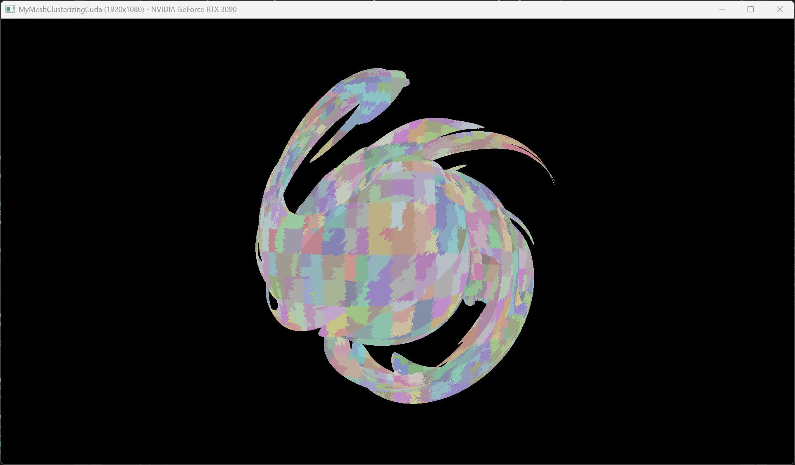
  <figcaption align="center">
    **[그림 1]** Dynamic Reclustering
  </figcaption>
</figure>

[](https://youtu.be/Bw_Kcg8Qxz4)

각각의 Cluster들을 BLAS Instance로 구성하고 리클러스터링 시점마다 BLAS를 리빌드한다.

## 2. gmc Pass Sequence

### 1. Generate Morton Code
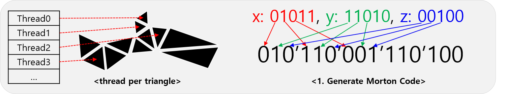

각 thread가 하나의 삼각형을 담당하여 Morton Code 생성.\
여기서 각 삼각형의 AABB, 전체 루트의 AABB를 연산하는 과정도 포함한다.

### 2. Sort by Morton Code
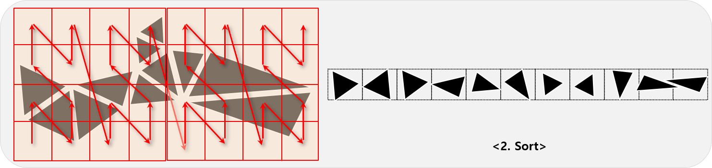

Morton Code 기반으로 정렬.

### 3. Update Index Buffer
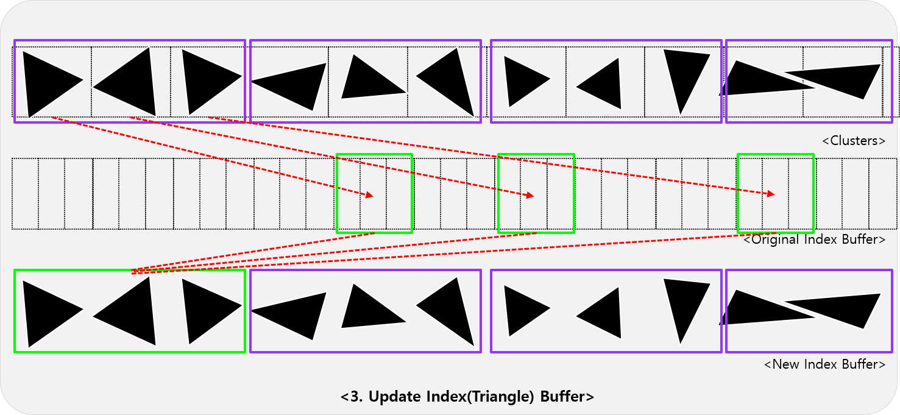

고정된 크기 Cluster Max Triangle을 기준으로 정렬된 배열에서 클러스터를 형성한 후 Index Buffer을 업데이트한다.\
만약 Index Buffer가 device 포인터라면 OldIndexBuffer과 NewIndexBuffer 포인터를 스왑하고, CPU 포인터라면 D2H Memcpy를 한다.

## 3. AABB Reduction 개선
Morton 코드를 생성하기 위해서는 Root AABB를 알고 있어야 하는데 AABB의 흡수(두 AABB를 합쳐 새로운 AABB를 만드는 것) Reduction 연산을 전체 삼각형에 대해 수행해야 한다.

### 1차 구현
```c++
gmcCuda::Kernels::Fill_AABBs <<<gridDim, blockSize >>> (
	m_numTriangles,
	m_dPositions,
	m_dOldIndexBuffer,
	m_dAABBs);
CUDA_SYNC_CHECK();

// Root AABB
m_rootAABB = AABB();
m_rootAABB = thrust::reduce(
	thrust::device,
	m_dAABBs, m_dAABBs + m_numTriangles, m_rootAABB,
	Kernels::MergeAABBFunctor());
CUDA_SYNC_CHECK();
```

이렇게 먼저 각 삼각형에 대해 AABB를 만들고 Thrust 라이브러리의 reduce() 함수에 의존하여 Root AABB 연산을 하였지만 삼각형 87만개 Mesh 기준 각각 0.061ms, 1.2ms로 총 1.26ms 가 소요되어 개선의 필요성을 느꼈다.

### 2차 구현 (개선 후)
Fill_AABBs와 reduction 커널을 통합하여 개선된 [Compute_AABBs](./gmcCuda/src/clusterBuilder.cu) 커널을 구현하였다.

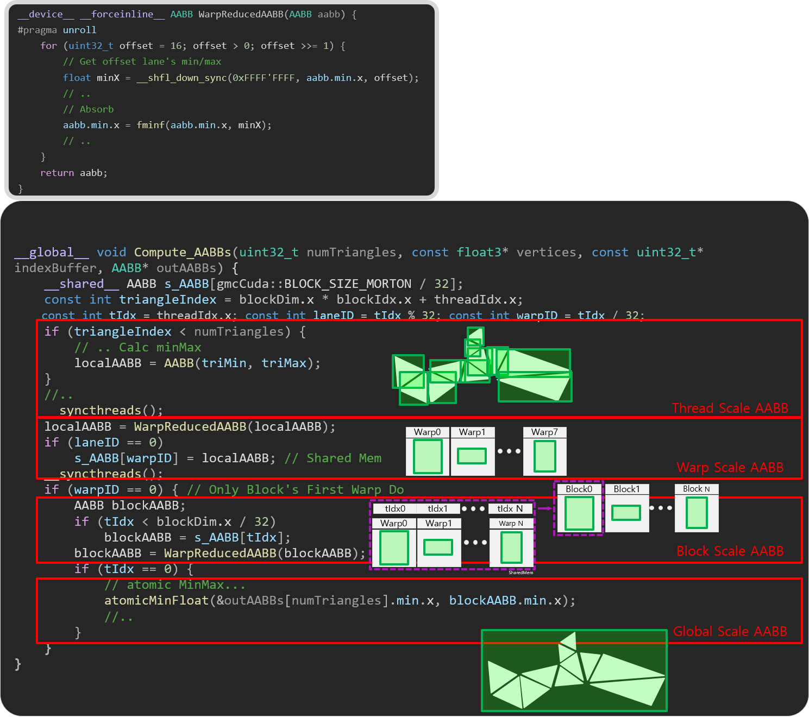


#### Thread Scale AABB
각 삼각형에 대해 AABB를 만들고 글로벌 메모리 outAABB에 저장.

#### Warp Scale AABB
`WarpReducedAABB`에서 shuffle down으로 warp단위 AABB를 형성한다.

1. Warp의 32개 쓰레드들 중 0~7 번 쓰레드는 나머지 쓰레드가 담당하는 AABB와 Abosrption을 하고
2. 이 과정을 점차 줄여가면서 최종적으로 0번 쓰레드가 Warp단위 AABB를 알고 있게 한다.
3. Warp 단위 AABB가 연산되었으면 Warp 리더들은 (Warp 개수) x (AAABB 크기) 만큼 할당된 Shared Memory에 저장한다.

#### Block Scale AABB
1. 0번 와프에서 현 쓰레드ID가 Block내 Warp 개수보다 작으면 다른 Warp를 대표한다. 대표할 수 없으면 유효하지 않은 AABB(FLT_MAX,-FLT_MAX).
2. 그리고 0번 와프에서 Warp Scale AABB끼리 다시 Warp 단위 Reduction을 수행한다. (`WarpReducedAABB`)
3. 각 Thread Block들의 첫번째 Thread Index는 Block 단위 AABB를 알고 있는 상태가 된다.

#### Global Scale AABB
```c++
__device__ __forceinline__ void atomicMinFloat(float* addr, float value) {
    if (*addr <= value) return;
    int* addr_as_int = (int*)addr;
    int old = *addr_as_int, assumed;
    do {
        assumed = old;
        if (__int_as_float(assumed) <= value) break;
        old = atomicCAS(addr_as_int, assumed, __float_as_int(value));
    } while (assumed != old);
}
```
Block 단위 AABB끼리 Abosorption 연산을 하는데 이 때 커스텀 된 atomic Float 연산을 한다.


## 4. meshoptimizer와 비교

### 속도 비교
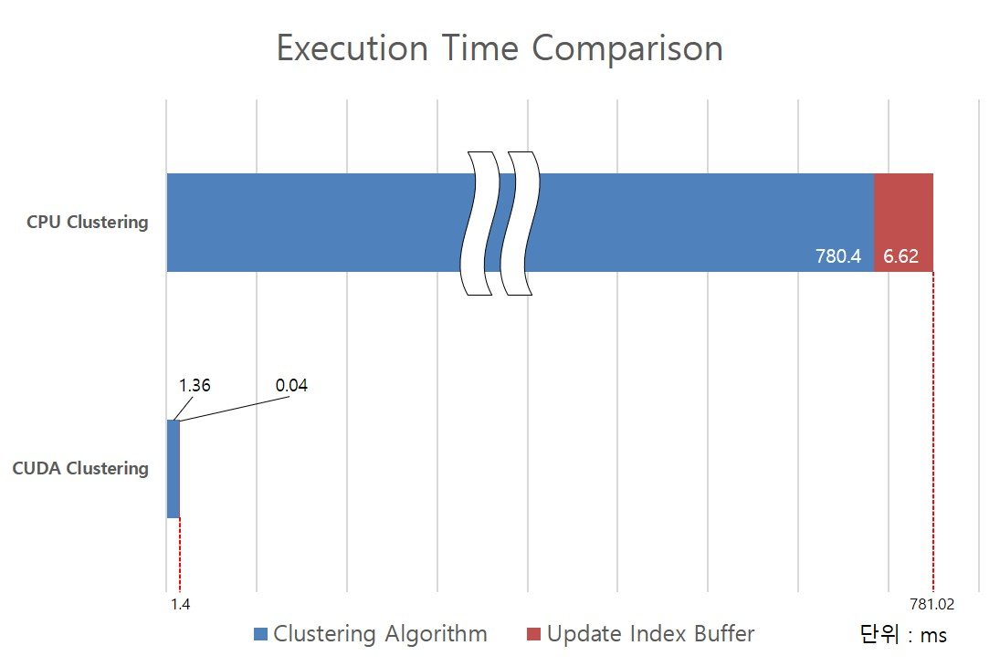

* Num Vertrices : 724,229
* Num Triangles : 871,306

780 ms -> 1.4 ms

물론 meshoptimizer의 클러스터링 함수가 실시간성을 염두에 두고 구현되지는 않았지만 큰 속도 향상을 보였고\
87만개 삼각형 Mesh에 대해 1.4 ms 의 소요시간을 보여 실시간 Reclustering에 기대를 하였다.

### 품질 비교

#### Best Case (변형 X)
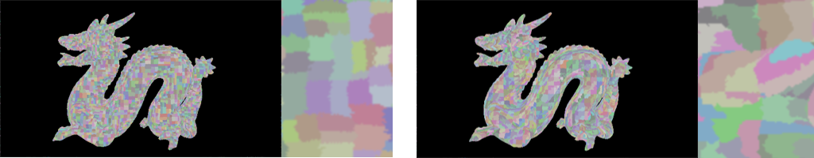
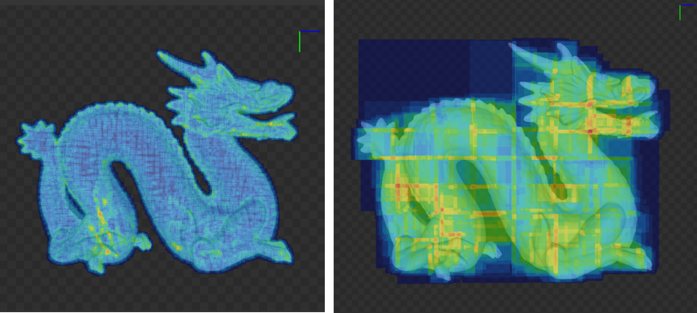
<figcaption align="center">
Meshoptimizer SAH Based (Left), My Morton Curve Based (Right)
</figcaption>

각각 클러스터의 시각화, 그리고 Nsight의 AABB Overlap Heatmap 이미지이다.\
SAH 기반 meshoptimizer 방식이 더 타이트하고 겹치는 부분이 현저히 적다.

#### Worst Case (변형 최대)
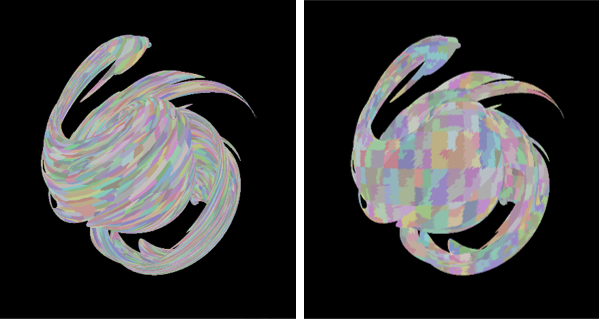
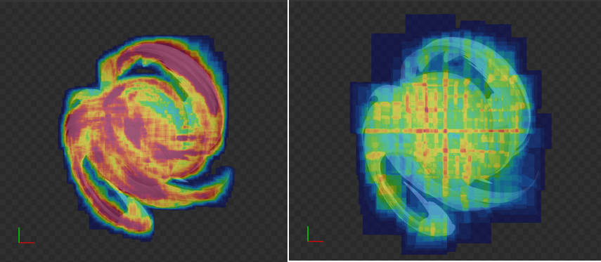
<figcaption align="center">
Meshoptimizer SAH Based (Left), My Morton Curve Based (Right)
</figcaption>

왼쪽은 meshoptimizer로 로딩 시점에 한 번만 Clustering을 한 것이다. Mesh의 Vertex Buffer가 직접 변형되었기 때문에 Cluster의 AABB가 깨진 모습이다.\
오른쪽은 gmc 라이브러리로 적절한 시점에 Reclustering을 한 모습이다. Nsight의 동일한 threshold의 Heatmap기준으로 겹침이 덜한 결과를 보인다.


## 5. Vulkan BLAS에 적용

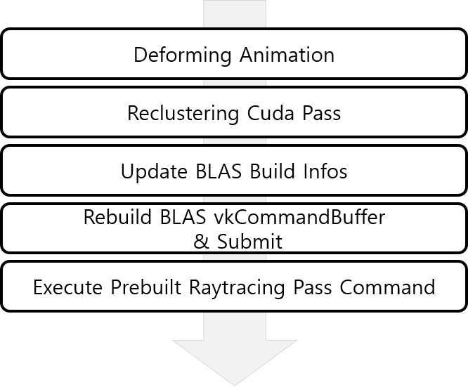

시퀀스는 그림과 같다.

1. Deforming Animation
    * Compute Shader로 직접 Vertex Buffer에 변형을 주어 클러스터의 AABB가 깨지게 된다.
2. Reclustering Cuda Pass
    * gmc 라이브러리에서 구현한 `BuildClusters_MortonBased()` 함수를 수행한다.
3. Update BLAS Build Infos
    * gmc Pass로 Index Buffer가 직접 변경되었기 때문에 BLAS Build에서 사용된 AS Geometry Build Infos를 업데이트한다. (CPU side)
4. Rebuild BLAS & vkCommnadBuffer Submit
    * 3번에서 Geometry Build Infos가 변경되었고, Update가 아닌 Build모드로 새로 명령을 생성해야 하기 때문에 `vkCmdBuildAccelerationStructuresKHR` 수행 후 Submit한다.
    * `vkCmdBuildAccelerationStructuresKHR`는 대상 AS의 개수가 많아질수록 오버헤드가 크다. 851개 인스턴스 기준 9.45ms 가 소요된다.
5. Execute Prebuilt Raytracing Pass Command
    * prebuild commnad buffer에는 *Update BLAS → Update TLAS → Raytracing* 가 수행된다.
    * 이 때 Reclustering 하는 시점에는 3,4번 BLAS Rebuild 패스가 수행되어 5번의 BLAS Update가 불필요한 패스가 수행되지만, 4번의 오버헤드를 근거로 감수한다.